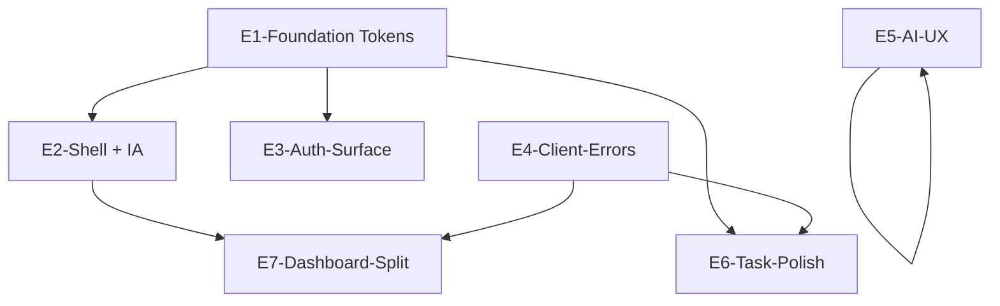

# 第一期技术拆分（ARCH）

**输入**：[PM_PHASE1_DELIVERY.md](./PM_PHASE1_DELIVERY.md)  
**输出**：Epic → Story、依赖、开发波次、与 DESIGN 的接口约定、关键文件落点建议。

---

## 1. 技术原则（一期）

| 原则 | 说明 |
|------|------|
| **少引入依赖** | 优先用现有 Tailwind 4 + CSS 变量；除非 DESIGN/DEV 强烈需要，一期不引入 Radix/shadcn 全量（避免与现有手写组件双轨）。 |
| **Token 单一来源** | 颜色/间距/圆角以 `:root` + `@theme inline` 为真源；组件只用语义类名或 `var(--*)`。 |
| **行为回归优先** | P0-DASH 拆分**不改**数据契约与交互，仅文件边界与 props 下沉。 |
| **401 已有行为** | `middleware` 对未登录 API 已返回 JSON 401；一期在**客户端**补「统一处理策略」，不大改中间件鉴权模型。 |
| **IA 少动路由** | P0-IA 优先 **侧栏分组 + 文案/角标**，避免大规模改 `href` 导致外链与书签失效。 |

---

## 2. Epic 总览（映射 PM ID）

| Epic | 覆盖 PM | 技术主题 |
|------|---------|----------|
| **E1-Foundation** | P0-DS | 设计 Token、字体、语义色、Tailwind 扩展 |
| **E2-Shell** | P0-SHELL, P0-IA | 主布局、侧栏分组、页头模板、（可选）PageHeader 组件 |
| **E3-Auth-Surface** | P0-AUTH-UX | 登录/注册页与 token 对齐 |
| **E4-Client-Errors** | P0-ERR | 可复用的 fetch 封装 + 401 跳转/Toast 策略 |
| **E5-AI-UX** | P0-AI-GUIDE | 助手/收件箱配置引导组件化 + 文案 |
| **E6-Task-Polish** | P0-TASK | 任务页与共享 UI 原语对齐 |
| **E7-Dashboard-Split** | P0-DASH | `page.tsx` 拆为 `components/dashboard/*` |
| **E8-P1-Stretch** | P1-* | 波次 3 或并行槽位 |

---

## 3. Story 清单（可进迭代板）

### E1-Foundation（P0-DS）

| Story ID | 描述 | 验收（技术） |
|----------|------|----------------|
| E1-01 | 扩展 `globals.css`：字阶（`text-page-title` / `text-section` / `text-body` / `text-caption` 等映射到具体 `rem`）、圆角阶梯（`sm/md/lg/xl`）、阴影（`shadow-card`）、间距刻度（与 `p-6` 等对齐的语义变量可选） | 全站可通过 class 或变量引用，无硬编码 `#` 散落于新代码 |
| E1-02 | 语义色：`success` / `warning` / `danger` / `info` 背景与文字对比度 ≥ 4.5:1（正文级，ARCH 抽查主要组合） | 任务状态、错误条、成功提示可复用 |
| E1-03 | `font-sans` 确认：**PingFang SC / Microsoft YaHei / system-ui** 优先于 Inter 作为中文主阅读（Inter 可保留为西文 fallback） | `body` 实测中文无「过细」问题 |

**DESIGN 先行交付物**：Figma 可无；**最少**给一页 Token 表（色名 + 用途 + 禁用例），DEV 按表落 E1-01～E1-03。

---

### E2-Shell（P0-SHELL + P0-IA）

| Story ID | 描述 | 验收（技术） |
|----------|------|----------------|
| E2-01 | `src/components/sidebar.tsx`：导航改为 **分组数据结构**（如 `core[]`、`collaboration[]`、`industry[]`、`system[]`），渲染分组标题与可选 `Beta`/`进阶` 角标 | 不改变现有 path 或仅增加 `title` 属性；键盘可聚焦链接 |
| E2-02 | `(main)/layout.tsx`：主区域统一 `max-w-*` 策略（建议 `max-w-7xl mx-auto w-full` 与 `px` 与现 `p-6` 协调） | 工作台/任务/项目视觉宽度一致 |
| E2-03 | 新增轻量 `PageHeader`（`title` + `description?` + `actions?`）供各页逐步采用 | 至少 1 个高频页接入作示范（建议 `tasks` 或 `projects`） |

**与 PM P0-IA 对齐**：分组命名用产品语言（如「工作台」「协作与配置」「行业与高级」），具体文案 PM 可改一字不改结构。

---

### E3-Auth-Surface（P0-AUTH-UX）

| Story ID | 描述 | 验收（技术） |
|----------|------|----------------|
| E3-01 | `(auth)/login`、`register`：背景、卡片、主按钮、输入框改用 **与主站相同的 CSS 变量 / 类**（可抽 `auth-card` 局部组合类） | 与工作台截图并置无明显「两个产品」 |
| E3-02 | 移动端：`max-w-sm` + padding 不溢出；触控目标 ≥ 44px（按钮高度） | iPhone 宽度模拟无横向滚动 |

---

### E4-Client-Errors（P0-ERR）

| Story ID | 描述 | 验收（技术） |
|----------|------|----------------|
| E4-01 | 新增 `src/lib/api-fetch.ts`（或同名）：`apiFetch(input, init)` → 统一 `credentials: 'include'`；若 `res.status===401` 则 `window.location.href='/login'`（或 `router.push`）**仅对非 auth API** | 避免在登录页请求死循环：需 `skipAuthRedirect` 选项或路径白名单 |
| E4-02 | 对 `5xx` / 网络错误：导出 `getErrorMessage(res)` 或抛出带 `code` 的 Error，供页面 Toast/内联展示（一期可用简单 `alert` 过渡 **禁止上生产**，建议最小 `toast` 状态或顶栏横幅） | PM 验收「有反馈」；实现方式 DEV 可选轻量自研 10 行 context |
| E4-03 | 选 **2～3 个高频页**（`tasks`、`projects` 列表、`page.tsx` 工作台主请求）改用 `apiFetch` | 回归路径无回归 |

**注意**：`header.tsx`、`inbox`、`assistant` 等大量原生 `fetch` 可波次迁移，一期不强制全站替换。

---

### E5-AI-UX（P0-AI-GUIDE）

| Story ID | 描述 | 验收（技术） |
|----------|------|----------------|
| E5-01 | 抽 `AiServiceConfigHint` 组件：并列说明 **本地 `.env`** 与 **Vercel Environment Variables**，链到 `docs/DEPLOY_VERCEL.md` 或 README 锚点 | `assistant/page.tsx` 内 `ConfigGuide` 替换为引用组件 |
| E5-02 | 收件箱页若存在「无 Key」错误展示，复用同一组件或同文案源（`lib/copy/ai-config.ts` 单文件常量） | 文案单一来源，避免漂移 |

---

### E6-Task-Polish（P0-TASK）

| Story ID | 描述 | 验收（技术） |
|----------|------|----------------|
| E6-01 | 任务列表：加载骨架或统一 `Loader2` 区块样式与 E1 token 一致 |  |
| E6-02 | 空状态：插图/文案 + 主按钮「新建任务」与 DS 按钮样式一致 |  |
| E6-03 | 弹窗表单：`TaskFormModal` 的 label/input/error 与 E1 表单规范一致 | 保存成功/失败有明确视觉反馈（现有 `saveError` 强化样式即可） |

---

### E7-Dashboard-Split（P0-DASH）

| Story ID | 描述 | 验收（技术） |
|----------|------|----------------|
| E7-01 | 新建 `src/components/dashboard/`：`DashboardStatsSection`、`DashboardTasksSection`、`DashboardCalendarSection` 等（按 `page.tsx` 实际区块切，**以 3～6 个文件为目标**，避免过碎） | `page.tsx` 仅组合与数据 hook，**行数显著下降** |
| E7-02 | 共享类型迁入 `src/components/dashboard/types.ts` 或 `lib/types/dashboard.ts` | `tsc` 无新增 any 泛滥 |
| E7-03 | 不改变既有 `fetch('/api/stats')` 等 URL 与 JSON 形状 | QA 对比拆分前后网络请求一致 |

**依赖**：建议 **E7 在 E1+E2 之后**，否则拆分后仍要大改样式两次。

---

## 4. 依赖关系（Mermaid）

说明：

- **E4 与 E1 无硬依赖**，可与 E1 并行启动；但与 **E6/E7** 结合才有端到端价值。  
- **E7 依赖 E2**（布局宽度/页头模式稳定后再拆工作台，减少合并冲突）。  
- **E5 可独立**与 E1 弱相关（仅 Typography）。

---

## 5. 开发波次（建议 3 波）

### 波次 A — 「底座 + 壳」（约 1 个迭代）

1. E1-01～E1-03（Tokens）  
2. E2-01～E2-03（Shell + IA）  
3. E3-01～E3-02（Auth 视觉）  

**产出**：全站「像一个产品」；导航分层可见。

---

### 波次 B — 「错误与 AI 可信 + 任务」

1. E4-01～E4-03（api-fetch + 试点页面）  
2. E5-01～E5-02（AI 引导组件化）  
3. E6-01～E6-03（任务抛光）  

**产出**：PM 的 P0-ERR / P0-AI-GUIDE / P0-TASK 可验收。

---

### 波次 C — 「工作台拆分 + P1 择优」

1. E7-01～E7-03（Dashboard 拆分）  
2. 按需插入：`P1-PROJ`、`P1-SEARCH`、`P1-SETTINGS`、`P1-INBOX`、`P1-ORG`、`P1-DOC`（ARCH 建议顺序：**SETTINGS → SEARCH → PROJ → INBOX → ORG → DOC**）

---

## 6. 路由与权限（一期结论）

- **不改** `middleware.ts` 的 `PUBLIC_PATHS` 集合（除非 E4 引入新的公共 API 路径）。  
- **P0-IA** 不新增动态路由；若未来隐藏「工艺单」等，可用 **feature flag 环境变量**（二期），一期仅用 UI 分组。  

---

## 7. 风险与缓解

| 风险 | 缓解 |
|------|------|
| Token 大改导致全站色差 | E1 先合并、波次 A 内冻结 token 名，后续只增不删 |
| `apiFetch` 401 与 RSC/SSR 混用 | 一期仅在 **`"use client"` 页面** 使用；Server Component 保持原样 |
| Dashboard 拆分 PR 过大 | 按区块拆 2 个 PR：先类型+2 区块，再剩余区块 |
| DESIGN 延迟 | E1 用 ARCH 文档中的默认刻度先落地，DESIGN 后补对比度微调 |

---

## 8. 给 DESIGN 的接口清单（冻结前需对齐）

**正式规格见 [DESIGN_SPEC_PHASE1.md](./DESIGN_SPEC_PHASE1.md)**（已含 Token、字阶、五组件、整体风格与侧栏 IA 占位）。冻结前仍需：

1. PM 确认侧栏**分组标题**与 **Beta/行业** 角标策略。  
2. DESIGN 与 DEV 确认是否引入 headless 组件库（一期默认不引入，见 §1 原则）。

---

## 9. 文档联动

- PM 清单：[PM_PHASE1_DELIVERY.md](./PM_PHASE1_DELIVERY.md)  
- 项目地图：[PROJECT_AUDIT.md](./PROJECT_AUDIT.md)  
- 协作角色：[AI_TEAM.md](./AI_TEAM.md)  

---

## 10. 修订记录

| 日期 | 版本 | 说明 |
|------|------|------|
| 2026-03-20 | v1 | ARCH 初版拆分与波次 |
| 2026-03-20 | v1.1 | **波次 A 部分落地（DEV）**：侧栏分组（E2-01）、主区 `max-w-7xl`（E2-02）、`PageHeader` + 任务页示范（E2-03）、登录/注册对齐 Token（E3）；`src/lib/auth-styles.ts`、`src/components/page-header.tsx` |
| 2026-03-20 | v1.2 | **波次 B 落地（DEV）**：`apiFetch` + 登录 `next` 回跳（E4）；`AiServiceConfigHint` + `lib/copy/ai-config`、助手/收件箱（E5）；任务骨架屏与空状态（E6）；试点 `apiFetch`：工作台、任务、项目 |
| 2026-03-20 | v1.3 | **波次 C（E7）**：工作台拆分为 `src/components/dashboard/*` + `useDashboardData`；`page.tsx` 仅组合区块 |
| 2026-03-20 | v1.4 | **P1 落地**：设置折叠说明、顶栏搜索 a11y/直达项目、项目列表 PageHeader+骨架+错误、组织说明与空状态、收件箱/助手角色文案、`/help`、侧栏入口、客户端请求统一 `apiFetch`、`docs/QA_P0_CHECKLIST.md` + `npm run qa` |
| 2026-03-20 | v1.5 | **设计二期 + 会话**：`globals.css` 靛青体系与主区玻璃壳；认证页光斑背景；默认会话 **24h** + 可选 `SESSION_MAX_AGE_SECONDS`（`src/lib/auth/session.ts`）；`DEPLOY_VERCEL.md` / `DESIGN_SPEC` 修订 |

---

## 附录 A · 波次 A 已落地文件（DEV）

| 项 | 文件 |
|----|------|
| 侧栏分组 + Beta/行业角标 | `src/components/sidebar.tsx` |
| 主内容区宽度 | `src/app/(main)/layout.tsx` |
| 页面标题模板 | `src/components/page-header.tsx` |
| 任务页接入 PageHeader | `src/app/(main)/tasks/page.tsx` |
| 认证页样式常量 | `src/lib/auth-styles.ts` |
| 登录 / 注册 / Auth 布局 | `src/app/(auth)/login/page.tsx`、`register/page.tsx`、`layout.tsx` |
| 全局 Token（早前） | `src/app/globals.css` |

---

## 附录 B · 波次 B 已落地文件（DEV）

| 项 | 文件 |
|----|------|
| 统一 fetch + 401 跳转 | `src/lib/api-fetch.ts` |
| AI 配置文案单源 | `src/lib/copy/ai-config.ts` |
| AI 配置 UI | `src/components/ai-service-config-hint.tsx` |
| 登录回跳 `?next=` | `src/app/(auth)/login/page.tsx` |
| 试点替换 `apiFetch` | `src/app/(main)/page.tsx`（组合层）、`tasks/page.tsx`、`projects/page.tsx`；工作台数据逻辑见 `src/components/dashboard/use-dashboard-data.ts` |
| 助手 / 收件箱 | `src/app/(main)/assistant/page.tsx`、`inbox/page.tsx` |
| 任务加载与空状态 | `src/app/(main)/tasks/page.tsx` |

---

## 附录 C · 波次 C（E7）已落地文件（DEV）

| 项 | 文件 |
|----|------|
| Dashboard 类型 | `src/components/dashboard/types.ts` |
| 数据加载与 visibility 刷新 | `src/components/dashboard/use-dashboard-data.ts` |
| 页头 + 总览卡片 + 本周 + 提醒 | `src/components/dashboard/dashboard-stats-section.tsx` |
| 今日日程 + 日程弹窗 | `src/components/dashboard/dashboard-calendar-section.tsx` |
| 高优 / 即将到期 | `src/components/dashboard/dashboard-tasks-section.tsx` |
| 项目概览 | `src/components/dashboard/dashboard-projects-section.tsx` |
| 快捷入口 + 最近更新 | `src/components/dashboard/dashboard-links-recent-section.tsx` |
| 工作台路由页（组合） | `src/app/(main)/page.tsx` |

---

## 附录 D · P1 与 QA（DEV）

| 项 | 文件 |
|----|------|
| 功能地图页 | `src/app/(main)/help/page.tsx` |
| 侧栏「使用说明」 | `src/components/sidebar.tsx` |
| P0 回归清单 | `docs/QA_P0_CHECKLIST.md` |
| 质量门禁脚本 | `package.json` → `npm run qa` |
| 顶栏搜索/提醒/登出 `apiFetch` | `src/components/header.tsx` |
| 设置折叠与 PageHeader | `src/app/(main)/settings/page.tsx` |
| 项目列表体验 | `src/app/(main)/projects/page.tsx` |
| 组织说明与 apiFetch | `src/app/(main)/organizations/page.tsx`、`organizations/[orgId]/page.tsx` |
| 收件箱/助手文案 | `src/app/(main)/inbox/page.tsx`、`assistant/page.tsx` |
| 全站客户端 `fetch` → `apiFetch` | 除 `src/lib/api-fetch.ts` 外 `src/**/*.tsx` 已统一 |
