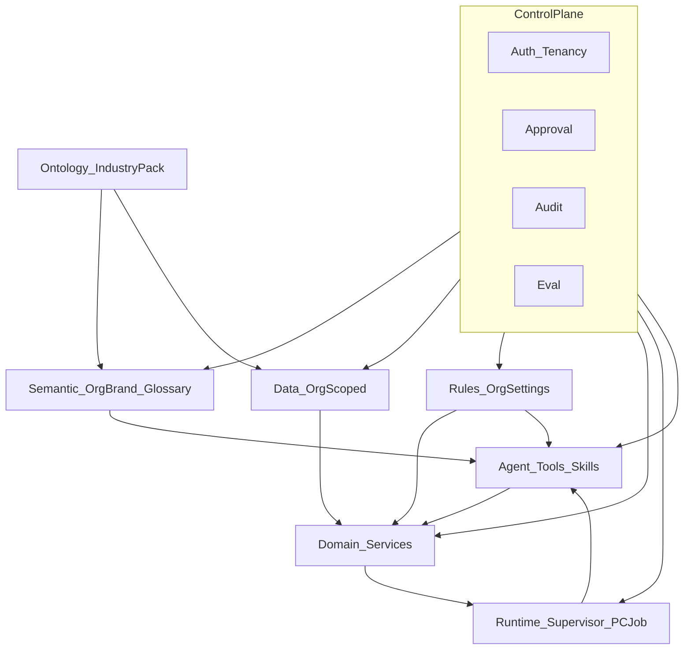

# 青砚业务 Agent 分层架构审计

> 审计日期：2026-07-21  
> 关联文档：[MULTI_TENANT_ARCHITECTURE_AUDIT.md](./MULTI_TENANT_ARCHITECTURE_AUDIT.md)、[MULTI_TENANT_PHASE1_DELIVERY.md](./MULTI_TENANT_PHASE1_DELIVERY.md)  
> 目标：在多租户边界之上，厘清「业务语义 → 本体 → 数据 → 规则 → 服务 → 编排 → Agent → 控制面」的真实落点，指导分阶段补齐，**不**建设复杂知识图谱，**不**重写已可用的 Supervisor / Agent Runtime。

---

## 0. 总原则与结论摘要

### 0.1 必须遵守

| 原则 | 含义 |
|------|------|
| 共享框架，不共享企业真相 | Sunny 与梦馨共用代码与 Platform 能力；**不共享**企业术语、本体实例、规则配置、经营数据、第三方凭证 |
| 四层租户边界 | `Platform → Organization → Workspace → Project`；业务真相以 **Organization** 为硬边界 |
| 控制面贯穿 | 各层读写必须带 `orgId`、权限、审批、审计；Eval 可观测、可回归 |
| 最小扰动 | 复用 Supervisor / Agent Runtime / ProductContent Job；优先补术语、本体注册、规则租户化、数据访问边界 |

### 0.2 成熟度一览

| 层 | 成熟度 | 一句话 |
|----|--------|--------|
| 1 语义层 | 弱 | Platform 硬编码 Sunny 语料多；Org Brand 有但不统一 |
| 2 本体层 | 中 | 实体丰富；行业 pack 仅家纺；窗饰价目为另一套平行本体 |
| 3 数据层 | 中偏强 | 核心表有 orgId；销售衍生表/向量仍靠 JOIN |
| 4 规则层 | 中 | ProductContent 审批较好；定价折扣全局单例是 P0 |
| 5 服务层 | 中 | 域服务齐全但 org 解析三套并存 |
| 6 编排层 | 中偏强 | Runtime + Supervisor 可用；入口分散，勿重写 |
| 7 Agent 层 | 中 | 工具/技能齐全；RBAC 绑平台角色非 orgRole |
| 8 控制面 | 中偏弱 | Tenancy 新未铺开；Eval 空转；审批多套 |

```text
Platform（框架 / 默认能力 / 公共 Skill 模板）
    ↓ 不可被下层覆盖：安全、租户隔离、合规
Organization（企业术语 / 本体实例 / 规则 / 数据 / 凭证）
    ↓ 可选
Workspace（部门默认配置 — 骨架已有，业务未挂）
    ↓ 可选
Project（项目覆盖 — 招投标域为主）
```

---

## 1. 语义层（Semantic）

### 1.1 当前对应

| 类别 | 路径 / 模型 |
|------|-------------|
| 专家角色 Prompt | `src/lib/ai/expert-roles.ts` |
| 销售知识提取 Prompt | `src/lib/ai/knowledge-extractor.ts` |
| 公司/品牌注入 | `src/lib/ai/company-context.ts`、`src/lib/operations/brand-context.ts` |
| 运营品牌档案 | Prisma `BrandProfile`（org 唯一） |
| 营销品牌 / PMC | Prisma `MarketingBrandProfile`、`src/lib/marketing/product-marketing-context.ts` |
| 行业字段标签（双语） | `src/lib/product-content/industry-packs/home-textile.ts` |
| UI i18n | `src/lib/i18n/*`（导航/通用，非行业术语表） |
| 数字员工 Skill 种子 | `src/lib/agent-core/skills/*-seed.ts`（含 operations-seed Sunny 文案） |
| 报价/邮件硬编码品牌 | `src/lib/sales/ai-quote-parser.ts`、`src/app/quote/[token]/page.tsx`、邮件模板等 |

### 1.2 归属

| 内容 | 归属 |
|------|------|
| UI 文案、通用安全红线 | Platform |
| BrandProfile / MarketingBrandProfile / Org AgentSkill 文案 | Organization |
| Workspace / Project 级术语覆盖 | **缺失** |

### 1.3 混用 / 分散 / 缺失 / 重复

- **混用风险（高）**：`sales_advisor`、knowledge-extractor、operations-seed、报价页写死 Sunny / sunnyshutter；梦馨会话也会吃到窗饰语义。
- **分散**：品牌真相源分裂为 `BrandProfile`（内容运营）与 `MarketingBrandProfile`（增长/NAP），靠 PMC 读时聚合。
- **缺失**：无「企业术语表 / Glossary」模型；无 industry 切换后的专家角色矩阵；无 Workspace 默认话术。
- **重复**：禁忌语同时存在于 BrandProfile.forbiddenClaims、MarketingBrandProfile.forbiddenContexts、operations content-rules 硬编码正则。

### 1.4 越权与安全

- 语义污染 ≠ 直接 IDOR，但会导致错误建议、错误邮件抬头、跨行业幻觉，属于**经营安全**问题。
- Skill 种子若对任意 org 灌 Sunny 文案，等于把样板租户语义扩散为 Platform 默认。

### 1.5 建议

| 动作 | 阶段 |
|------|------|
| **保留** BrandProfile / MarketingBrandProfile / PMC 聚合思路 | — |
| **统一** 对外「当前企业品牌上下文」单一读取 API（主从或视图） | P1 |
| **重构** expert-roles / knowledge-extractor / operations-seed：默认读 Org Brand + industry pack，去掉 Sunny 字面默认 | P1 |
| **新增** Org 级 `BusinessGlossary` 或 `modulesJson` 旁路 `terminologyJson`（轻量 JSON，非图谱） | P1 |
| **不建** 复杂知识图谱 / 实体链接引擎 | 明确不做 |

---

## 2. 本体层（Ontology）

### 2.1 当前对应

| 类别 | 路径 / 模型 |
|------|-------------|
| CRM 本体 | `SalesCustomer`、Opportunity、Interaction、Quote、Measurement… |
| 外贸本体 | `TradeProspect`、Campaign、Quote、`src/lib/trade/stage.ts` |
| 招投标/项目 | `Project`（可选 `orgId`/`workspaceId`）、Task、Inquiry… |
| 产品内容事实 | `ProductContentJob`、`ProductFact`、Conflict、`facts/priority.ts` |
| 家纺行业字段图 | `industry-packs/home-textile.ts`、`product-content/types.ts` |
| 窗饰 SKU/工艺本体 | `src/lib/blinds/pricing-types.ts`、`pricing-data.ts`、`deduction-rules.ts`、`sku-catalog.ts` |
| 模块能力本体 | `src/lib/tenancy/modules.ts`（sales/trade/product_content…） |
| 岗位 Playbook / Skill 定义 | `RolePlaybook`、`AgentSkill`（按 org） |

### 2.2 归属

| 内容 | 归属 |
|------|------|
| 字段枚举、状态机定义、industry pack 模板 | Platform（框架） |
| 具体客户/线索/Fact/价目实例 | Organization |
| Workspace 挂靠 | 仅 `Project.workspaceId` 可选；CRM/Trade/PC **未挂** |
| Project 类型标签等 | Project |

### 2.3 混用 / 分散 / 缺失 / 重复

- **平行两套行业本体**：窗饰（blinds + sales 画像枚举）vs 家纺（industry-pack + ProductFact），靠 modules 软分流，**无 Industry Registry**。
- **`getIndustryPack` 未知 id 静默回退 `home_textile`**：窗饰 Job 可能被套上家纺字段图。
- **CustomerProfile / SalesKnowledgeChunk** 枚举偏北美窗饰，却可被任意 org 写入。
- **缺失**：`window_covering` pack；Org 级 SKU/价目本体；Workspace 业务本体挂载。
- **重复**：产品分类同时存在于 blinds catalog、HOME_TEXTILE_CATEGORIES、画像 productPreferences。

### 2.4 越权与安全

- 本体模板 Platform 共享合理；**实例数据**必须 org 隔离（见数据层）。
- 静默 pack 回退会导致错误字段校验与错误生成，属数据质量/合规风险。

### 2.5 建议

| 动作 | 阶段 |
|------|------|
| **保留** ProductFact + industry-pack 作为「结构化本体」样板 | — |
| **统一** `IndustryPackRegistry`：显式注册 `home_textile` / `window_covering`；禁止静默回退 | P1 |
| **新增** Sunny 用 `window_covering` pack（字段映射到现有 blinds 概念，不一次搬库） | P1 |
| **重构** 画像/FAQ 枚举随 pack 或 org.settings 切换 | P2 |
| **不做** 通用 OWL/图数据库本体平台 | 明确不做 |

---

## 3. 数据层（Data）

### 3.1 当前对应

| 类别 | 路径 |
|------|------|
| Schema | `prisma/schema.prisma` |
| Org 知识向量 | `src/lib/knowledge/org-knowledge.ts` → `OrgKnowledgeChunk` |
| 销售向量 | `src/lib/sales/vector-search.ts`（JOIN `SalesCustomer.orgId`） |
| 用户记忆 | `src/lib/ai/memory-storage.ts` / `memory-search.ts` → `UserMemory` |
| 会话 embedding | `src/lib/context/search-engine.ts` → `MessageEmbedding`（orgId 可选） |
| Blob | `src/lib/files/blob-access.ts`、`/api/files/[...path]` |
| Tenancy 辅助 | `src/lib/tenancy/assert.ts`、`pathnameDeclaresOrg` |

### 3.2 归属

| 数据 | 归属 |
|------|------|
| CRM / Trade / ProductContent / OrgKnowledge / UserMemory / AgentRun | Organization（列级 orgId 为主） |
| 项目文档 / 旧 KnowledgeBase | Project（间接 org） |
| Workspace 行 | Organization 子实体（骨架） |
| 平台目录 | Platform（如 visualizer catalog `orgId=null`） |

### 3.3 混用 / 分散 / 缺失 / 重复

- **两套知识库**：Project `KnowledgeBase` vs Org `OrgKnowledgeDocument`。
- **两套记忆**：`UserMemory` vs `getProjectAiMemory` 聚合。
- **列级缺口**：`SalesKnowledgeChunk`、`CustomerProfile`、`SalesInsight`、`MeasurementRecord` 无 `orgId`（靠 JOIN，漏则串租）。
- **`Project.orgId` 可选**、**`QuoteDiscountSettings` 全局 singleton**。
- **重复写入路径**：多服务直接 `db.*`，无统一 repository。

### 3.4 越权与安全

| 风险 | 级别 |
|------|------|
| 向量/画像 API 漏 org（已部分修复，需持续守门） | P0/P1 |
| `MessageEmbedding` 未传 orgId 时按 user 跨 org 召回 | P1 |
| Blob 历史 public store 兼容读；`sales-quotes/` 未进代理白名单 | P1 |
| 凭证 Gmail/Calendar 按 userId 非 orgId | P1 |

### 3.5 建议

| 动作 | 阶段 |
|------|------|
| **保留** OrgKnowledge / UserMemory 强制 orgId 模式 | — |
| **统一** 写路径辅助：`assertEntityBelongsToOrg` + 逐步 `requireTenantContext` | P0 持续 |
| **补齐** 销售衍生表列级 `orgId` backfill（可判定归属再迁） | P1 |
| **租户化** `QuoteDiscountSettings` → 按 orgId | P0 |
| **不做** 独立企业物理库（除非产品明确要「独立库企业版」） | 远期 |

---

## 4. 规则层（Rules）

### 4.1 当前对应

| 类别 | 路径 |
|------|------|
| 产品内容审批 | `product-content/approval/policy.ts`、`AgentApprovalSettings` |
| 产品内容状态机 / 保真 QA | `jobs/status.ts`、`qa/fidelity.ts` |
| 企业项目规则 | `OrganizationProjectRule`、`src/lib/projects/org-rules.ts` |
| 发布内容拦截 | `src/lib/operations/content-rules.ts` |
| Employee AI / Playbook | `src/lib/employee-ai/*`、`RolePlaybook` |
| Supervisor / Employee 灰度 | `agent-supervisor/flags.ts`、`employee-ai/flags.ts` |
| Agent 工具策略 | `agent-core/tools/_policy.ts` |
| 窗饰定价/折扣/减尺 | `blinds/pricing-engine.ts`、`discount-settings.ts`、`deduction-rules.ts` |
| 模块开关 | `tenancy/modules.ts` → `Organization.modulesJson` |

### 4.2 归属

| 规则 | 归属 |
|------|------|
| 状态机骨架、工具 risk 等级、env 灰度 | Platform |
| ApprovalSettings、OrgProjectRule、Playbook、modulesJson | Organization |
| Workspace 默认审批/技能 | **缺失（settingsJson 预留）** |
| 项目通知偏好 | Project/User（易与 OrgProjectRule 混淆） |

### 4.3 混用 / 分散 / 缺失 / 重复

- **P0 混用**：`QuoteDiscountSettings` 全局一行；折扣码硬编码 Sunny2026。
- **Platform 硬规则**：content-rules（加拿大窗饰语境）、fidelity 阈值、blinds MSRP/减尺。
- **分散审批**：PendingAction / ProductContentApproval / AgentApprovalSettings / 旧 ApprovalRequest。
- **重复**：禁忌语规则（Brand vs content-rules）；通知 `project-rules` 与企业 `org-rules` 命名冲突。
- **缺失**：Workspace 规则；按 industry pack 的默认审批策略；工具策略按 orgRole。

### 4.4 越权与安全

- 全局折扣/定金设置可被一企业改到影响全体。
- 工具 `_policy` 看平台 `User.role`，不看 `OrganizationMember.role`。
- Employee AI / Supervisor 默认关 + allowlist（正确）；勿在本阶段自动生产全开。

### 4.5 建议

| 动作 | 阶段 |
|------|------|
| **保留** ProductContent 审批策略与 OrgProjectRule「人工确认再生效」 | — |
| **立即租户化** QuoteDiscountSettings + 折扣码配置 | P0 |
| **统一** content-rules 读取 Org forbiddenClaims / pack | P1 |
| **扩展** AgentApprovalSettings 或 org.settingsJson：fidelity 阈值、默认工具策略 | P1 |
| **不重写** 为通用规则引擎 DSL | 避免过度设计 |

---

## 5. 服务层（Services）

### 5.1 当前对应

| 域 | 库 | API |
|----|----|-----|
| Sales | `src/lib/sales/` | `/api/sales/**` |
| Trade | `src/lib/trade/` | `/api/trade/**` |
| Product Content | `src/lib/product-content/` | `/api/product-content/**` |
| Projects | `src/lib/projects/` | `/api/projects/**` |
| Marketing | `src/lib/marketing/` | `/api/marketing/**` |
| Operations | `src/lib/operations/` | `/api/operations/**` |
| Org Knowledge | `src/lib/knowledge/` | `/api/org/knowledge/**` |
| Workspaces | `src/lib/tenancy` | `/api/org/workspaces` |
| Pending Actions | `src/lib/pending-actions/` | 秘书/营销审批相关 API |

### 5.2 归属

- 经营域服务：**Organization** 上下文（query `orgId` + membership）。
- 项目域服务：**Project** 读权限 + 可选 org。
- Workspace API：骨架，业务域未强制。

### 5.3 混用 / 分散 / 缺失 / 重复

- **三套 org 解析**：`resolveTradeOrgId`（主流）、`requireTenantContext`（新、未铺开）、`resolveEmployeeAiOrgId` / activeOrg 直读。
- **分散**：无统一 application service 边界；handler 内直接 Prisma。
- **重复**：各域各自 `assert*InOrg`。
- **缺失**：modulesJson **不挡 API**（仅侧栏）；服务层无 Workspace 过滤。

### 5.4 越权与安全

- 平台 admin 经 `resolveTradeOrgId` **可不加入 membership** 访问企业数据（与 `requireTenantContext` 默认行为不一致）— 控制面技术债。
- 新接口应走 TenantContext；旧接口分批迁移。

### 5.5 建议

| 动作 | 阶段 |
|------|------|
| **保留** 域目录拆分（sales/trade/product-content…） | — |
| **统一** 新代码强制 `requireTenantContext`；关键写路径先迁移 | P0–P1 |
| **对齐** 平台运维旁路：仅白名单 API `allowPlatformBypass` | P1 |
| **可选** modules 中间件挡未启用模块的 API | P2 |

---

## 6. 编排层（Orchestration）

### 6.1 当前对应

| 子系统 | 路径 |
|--------|------|
| Agent Runtime | `src/lib/agent-runtime/`（session、run、queue、plan、dispatch） |
| Agent Supervisor | `src/lib/agent-supervisor/`（engine、graph、planner、workers、flags） |
| Product Content Job | `src/lib/product-content/jobs/runtime.ts`、`service.ts`、`approve-deliver.ts` |
| Marketing 自动化 | `src/lib/marketing/automation-schedule.ts`、cron |
| Trade / 其它 Cron | `src/app/api/cron/*`、`src/lib/trade/cron-jobs.ts` |
| 遗留 Agent skills | `src/lib/agent/`（与 agent-core 并存） |

### 6.2 归属

- Run/Session/Event：**Organization**（orgId 必填）。
- ProductContent 流水线：**Organization + Job**。
- Cron：Platform 调度，按 org 迭代任务。
- Workspace：编排层未使用。

### 6.3 混用 / 分散 / 缺失 / 重复

- **双编排栈 + 遗留第三入口**：Runtime / Supervisor / `src/lib/agent` — **分散但不建议重写**；应冻结遗留、收敛入口文档。
- 队列认领按全局 lease，信任写入时的 orgId（写入端必须正确）。
- **缺失**：跨域统一「经营编排」抽象；Workspace 级默认 Agent 路由。

### 6.4 越权与安全

- Cron `CRON_SECRET` 泄露可触发全库后台任务。
- Supervisor / Employee AI **保持默认关闭 + allowlist**（与产品阶段一致）。

### 6.5 建议

| 动作 | 阶段 |
|------|------|
| **保留并强化** Agent Runtime + Supervisor（修 bug / 加 org 断言，不换内核） | 持续 |
| **文档化** 入口矩阵：何时用 Runtime vs Supervisor vs ProductContent Job | P1 |
| **收敛** 遗留 `src/lib/agent` 调用点，禁止新功能接入 | P1 |
| **不做** 用新框架整体替换 Supervisor/Runtime | 明确不做 |

---

## 7. Agent 层

### 7.1 当前对应

| 组件 | 路径 |
|------|------|
| Tool Registry / Policy | `src/lib/agent-core/tools/tool-registry.ts`、`_policy.ts` |
| 域工具 | `tools/sales-*.ts`、`trade.ts`、`marketing.ts`、`product-content.ts`、`org-knowledge.ts`… |
| Skills / 数字员工 | `src/lib/agent-core/skills/*`、`digital-employee-roles.ts` |
| PendingAction 桥 | `skills/pending-action-bridge.ts`、`pending-actions/executor.ts` |
| Employee AI | `src/lib/employee-ai/` |
| Expert roles | `src/lib/ai/expert-roles.ts` |
| API | `/api/agent-core/**`、assistant 相关入口 |

### 7.2 归属

| 组件 | 归属 |
|------|------|
| 工具实现与 risk 分级 | Platform 框架 |
| Org 激活的 Skill / Playbook 版本 | Organization |
| 工具执行数据读写 | 必须 Organization（ctx.orgId） |
| Workspace 默认 Agent | **缺失** |

### 7.3 混用 / 分散 / 缺失 / 重复

- 工具 RBAC = **平台 User.role**，不是 orgRole → 与多租户经营角色错位。
- Expert roles 与 Org Skill 双轨；种子技能含 Sunny 文案（语义层问题传导至此）。
- **重复**：销售教练 / AI advice / expert sales_advisor 多条建议路径。
- **缺失**：企业术语注入中间件；Eval 绑定 Agent 输出；按 modules 禁用整组工具。

### 7.4 越权与安全

- 工具必须带 `ctx.orgId`（已有约定）；`trade_get_prospect` 等已补 org 过滤，需防回归。
- 高风险写操作应继续走 PendingAction；product_content 部分 L1 直写需审批策略覆盖。
- **禁止** Agent 工具使用无 org 的全局 `findUnique`。

### 7.5 建议

| 动作 | 阶段 |
|------|------|
| **保留** tool-registry + PendingAction 白名单模式 | — |
| **补齐** 执行前注入 Org Brand + Glossary + pack；禁止 Sunny 默认 | P1 |
| **演进** 工具授权：platform role ∩ orgRole ∩ modules | P1–P2 |
| **接通** EvaluationCase 与关键工具回归 | P2 |
| **不重写** Agent 内核 | 明确不做 |

---

## 8. 跨层控制面（Control Plane）

### 8.1 当前对应

| 能力 | 路径 | 状态 |
|------|------|------|
| Auth / Guards | `src/lib/auth/guards.ts`、`session.ts` | 成熟，多入口 |
| Tenancy | `src/lib/tenancy/*` | **新**；业务 API 几乎未切换 |
| Active Org | `organizations/active-org.ts`、`/api/auth/active-org` | 可用；返回 modules |
| Audit | `src/lib/audit/logger.ts`、`AuditLog` | orgId 可选，覆盖不全 |
| Approvals | PendingAction / ProductContentApproval / ApprovalRequest | **多套** |
| AgentApprovalSettings | 产品内容域 | 不覆盖 sales/trade 全局 |
| Eval | Prisma `EvaluationCase` | **几乎无运行时** |
| Cost | `product-content/cost/ledger.ts` | 仅产品内容 |
| Feature Flags | supervisor / employee-ai env allowlist | 非 DB |
| Rate Limit | `common/rate-limit.ts` | 非租户配额 |

### 8.2 归属

| 控制能力 | 归属 |
|----------|------|
| 平台超管、Cron、公共模板发布 | Platform |
| 成员、模块、企业审批设置、企业凭证（目标态） | Organization |
| Workspace 成员/默认策略 | Workspace（骨架） |
| 项目成员/项目内审批 | Project |

### 8.3 混用 / 分散 / 缺失 / 重复

- **平台 admin vs org_admin 混用**：旧守卫静默升权；新 TenantContext 默认要求 membership — **行为分裂**。
- **审批重复**：至少三套模型。
- **Eval / 全局 Cost / 租户配额缺失**。
- **CONFIG_SCOPE 继承未实现**（仅类型）。

### 8.4 越权与安全

| 风险 | 级别 |
|------|------|
| 平台超管无 membership 读写企业经营数据 | P0（策略债） |
| 审计缺 orgId 导致无法按企业追责 | P1 |
| Eval 空转导致回归靠人工 | P1 |
| 无租户级成本熔断（仅 PC Job） | P2 |

### 8.5 建议

| 动作 | 阶段 |
|------|------|
| **保留** session + activeOrg + membership 模型 | — |
| **铺开** `requireTenantContext`；运维旁路显式白名单 | P0–P1 |
| **统一审批叙事**：PendingAction（通用）+ 域内专用审批（PC）并存但文档化边界 | P1 |
| **激活** EvaluationCase：先绑销售向量隔离 / 关键工具 golden cases | P1–P2 |
| **扩展** 审计强制 orgId（能判定时） | P1 |
| **不做** 一次重写全部权限系统 | 明确不做 |

---

## 9. 跨层依赖与数据流（目标态）



**Sunny vs 梦馨**：同一套框；不同的 `modulesJson`、Brand、industry pack、规则配置、数据库行（orgId）、凭证。

---

## 10. 分阶段实施路线（本审计建议）

### P0（安全与边界，优先）

1. `QuoteDiscountSettings` 租户化；去掉全局折扣码硬编码依赖。  
2. 继续堵住「无 org 过滤」的数据/工具路径；新 API 强制 TenantContext。  
3. 平台超管进企业数据改为显式 bypass，默认要求 membership。  

### P1（企业术语 / 本体 / 规则）

1. IndustryPackRegistry + `window_covering` pack；禁止静默回退。  
2. 语义去 Sunny 默认：expert-roles、knowledge-extractor、skill seed、报价展示读 Org Brand。  
3. BrandProfile / MarketingBrandProfile 统一读取面；content-rules 接 forbiddenClaims。  
4. Org 级轻量 `terminologyJson` / glossary（JSON，非图谱）。  
5. 销售衍生表 orgId 列 backfill；MessageEmbedding 强制 org。  
6. 文档化编排入口；冻结遗留 `src/lib/agent` 新接入。  

### P2（Workspace 与控制面深化）

1. Workspace 默认规则 / 默认 Skill / 默认知识库挂载。  
2. 工具授权：platform role ∩ orgRole ∩ modules。  
3. EvaluationCase 闭环；租户级 cost/rate 配额。  
4. 凭证 per-org；全局 AI cost ledger。  

### 明确不做

- 复杂知识图谱 / 图数据库本体平台  
- 重写 Supervisor 或 Agent Runtime  
- 为 Sunny / 梦馨复制代码或复制数据库  
- 自动打开 Employee AI / Supervisor 生产全量开关  
- 一次重写全部权限与审批系统  

---

## 11. 与多租户审计的衔接

| 多租户文档结论 | 本层审计补充 |
|----------------|--------------|
| Organization = Tenant | 各层「企业真相」必须以 org 为配置与数据边界 |
| Workspace 骨架已加 | 语义/规则/Agent **尚未挂接**；P2 再做 |
| P0 IDOR 已部分修复 | 规则层折扣单例、语义 Sunny 污染仍为经营安全债 |
| TenantContext 已建 | 服务层 / Agent 入口需持续铺开 |

---

## 12. 审计结论（给产品/工程）

青砚已经具备「能跑的多域 Agent + 编排」骨架，真正缺口不在再造一个 Agent 框架，而在：

1. **企业语义未租户化**（Sunny 默认污染 Platform）；  
2. **行业本体未注册化**（家纺 pack 与窗饰价目平行且会静默错配）；  
3. **规则未完全按 org 落地**（折扣全局单例为典型）；  
4. **控制面未统一**（Tenancy / 审批 / Eval / 超管旁路）。

下一步应：**补齐企业术语、本体注册、规则与数据访问边界**，让 Sunny 与梦馨在同一青砚中安全、独立地经营——共享框架，不共享真相。
