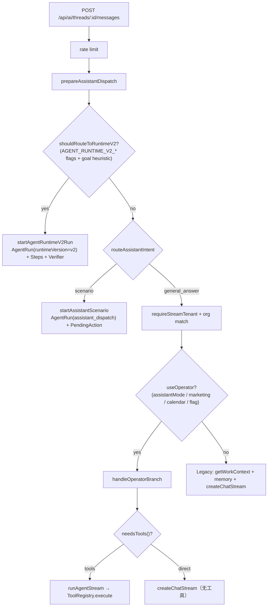

# 青砚 AI Runtime Consolidation — Phase 1 只读审计

- 基线：`main @ af15ea1`（含 PR #72 Phase 1.1.1）
- 分支：`feature/ai-runtime-consolidation-phase1`（独立 worktree，未改业务代码时产出本报告）
- 参考：Draft PR #52 `feature/qm-scope-runtime-phase1`（仅 architecture reference，明显落后 main，不 merge）
- 结论先行：确认 4 个 P0（审批闸未消费、空 allowlist 语义反转、无统一 ScopeContext、getWorkContext 跨 org），2 个 P1 结构性问题（V2 双工具真相源 + adapters 绕过 data scope；观测碎片化）。

---

## 1. AI 执行路径库存（真实调用关系）

| 路径 | 状态 | 入口 / 关键代码 |
|---|---|---|
| Legacy Chat | 存在（默认兜底） | `POST /api/ai/threads/[threadId]/messages` legacy 分支；`POST /api/ai/chat`；`createChatStream` |
| Operator | 存在（灰度） | 同 messages 路由 `handleOperatorBranch`；`isOperatorEnabled`；`runAgentStream` |
| Assistant Scenario Dispatch | 存在 | `prepareAssistantDispatch` → `startAssistantScenario`（`src/lib/assistant/dispatch.ts`） |
| Agent Core | 存在（引擎） | `src/lib/agent-core/engine.ts`（`runAgent` / `runAgentStream`）+ `tool-registry.ts` |
| Agent Runtime v1 | 存在（messaging 主用） | `src/lib/agent-runtime/process.ts` `executeConversationRun`；微信/企微 gateway |
| Agent Runtime V2 | 存在（allowlist 灰度） | `src/lib/agent-runtime-v2/*`：`shouldRouteToRuntimeV2` / `planAgentRuntimeV2` / `executor.ts` |
| Supervisor | 仍存在 | v1 `executeConversationRun` 内 + `POST /api/agent-supervisor/runs`；不在 web messages 主链 |
| QM Harness（PR #52） | 仅分支参考 | `src/lib/scope/*`、`agent-core/pre-execute-guard.ts`、`approval-gate.ts`、`agent-harness/*` |

### 1.1 `POST /api/ai/threads/[threadId]/messages` 调用图



### 1.2 十问对照表

| 问题 | Legacy | Operator | Scenario | Agent Core | Runtime v1 | Runtime V2 | Supervisor |
|---|---|---|---|---|---|---|---|
| 1 入口 | messages legacy 分支 / `api/ai/chat` | `handleOperatorBranch` | `prepareAssistantDispatch` | 被调引擎 | messaging gateway | dispatch V2 分支 | v1 内嵌 + 专用 API |
| 2 Context | `getWorkContext` + memory + company + project deep | `buildOperatorSystemPrompt` + project block | 场景内自建 | 调用方传入 | `loadMinimalContext` | planner goal + adapters 直查 | context-builder |
| 3 创建 AgentRun | 否 | 否 | 是（assistant_dispatch） | 否（可透传 id） | 是 | 是（v2） | 是/复用 |
| 4 记录 Tool Call | 无工具 | 内存 log + SSE，不落 AgentRunStep | 事件 `AgentRunEvent` | `toolCallLog` + hooks（可选 `ToolCallTrace`） | `AgentRunEvent` | `AgentRunStep` + 事件 | run 事件 |
| 5 PendingAction | 否 | 是（工具内草稿） | 是 | 取决于工具 | 是 | 是 | 是 |
| 6 Verifier | 否 | 否 | 否 | 否 | 否 | 是（`AgentRunVerification`） | summary-validator（私有） |
| 7 UserMemory | 读+写 | 否 | 否 | 否 | session summary | 否 | 否 |
| 8 严格 activeOrg | 流租户是；**Context 否** | 是 | 是 | 依赖调用方 | orgId 绑定 | Run 带 orgId；**读路径 org 全量** | orgId 参数 |
| 9 ToolRegistry | 否 | tools 模式是；direct 否 | 否 | 是（**extraTools 绕过**） | 部分间接 | **否（只走 adapters）** | 间接 |
| 10 统一审批 enforcement | N/A | 弱（靠 maxRisk+工具自觉） | PendingAction 自建 | **否** | ApprovalPort | 步骤级自建 | ApprovalPort |

---

## 2. P0 证据（file:line）

### P0-1 `requiresApproval` 未被执行层消费（审批可被绕过）

`canInvokeTool` 计算并返回标志（`src/lib/tenancy/tool-auth.ts:302-317`）：

```302:317:src/lib/tenancy/tool-auth.ts
  const requiresApproval =
    forceApproval === true ||
    toolPolicy?.forceApprovalTools?.includes(tool.name) === true ||
    workspaceToolPolicy?.forceApprovalTools?.includes(tool.name) === true ||
    risk === "l3_strong";
  return { ok: true, allowed: true, needsApproval: requiresApproval, requiresApproval, ... };
```

但 `ToolRegistry.execute` 只检查 `!decision.ok`，随后直接 `tool.execute`（`src/lib/agent-core/tool-registry.ts:150-155, 181, 220`）。
`requiresApproval=true` 的 l1/l2 工具照常执行 executor；`forceApprovalTools` 与 Workspace forceApproval 形同虚设。
l3 目前仅靠调用方传 `maxRisk: "l2_soft"` 在 list/execute 阶段挡掉——是"配置惯例"而非"引擎保证"。

**extraTools 完全绕过**（`src/lib/agent-core/engine.ts:143-151`）：`executeToolUnified` 命中 extraTools 时直接 `extra.execute(ctx)`，不经 canInvokeTool、不经配额、不经审批。stream / non-stream 共用此函数（`engine.ts:303-307, 701-705`），所以两条路一致地"绕过"。

Runtime V2 executor 同样只挡 `!decision.ok`（`src/lib/agent-runtime-v2/executor.ts:185-248`）。

### P0-2 空 tool allowlist = 全部工具（fail-open）

`src/lib/agent-core/tool-registry.ts:84-87`：

```84:87:src/lib/agent-core/tool-registry.ts
    if (filters?.names?.length) {
      const nameSet = new Set(filters.names);
      result = result.filter((t) => nameSet.has(t.name));
    }
```

`names: []` → `length===0` → 跳过过滤 → 返回全部（再经其他 filter）。类型注释甚至写明"空则全部可用"（`src/lib/agent-core/types.ts:162`）。
现有代码已被迫用 hack 规避：`runSimple` 传 `tools: ["__system_no_tools__"]` 强制零工具（`engine.ts:788-792`）。

### P0-3 无统一 ScopeContext

main 上不存在 `src/lib/scope`。各路径各自拼装 `userId/orgId/role/...` 进 `ToolExecutionContext`；工具 args 里的 `orgId/userId/projectId` 无统一防覆盖校验。PR #52 的 `ScopeContext` + `assertArgsMatchScopeGuard`（`pre-execute-guard.ts`）是正确方向，但其分支带 schema migration 与旧代码，不可直接合并，需在最新 main 上薄层重建并复用 `TenantContext / resolveAgentTenant / RBAC / TraceContext`。

### P0-4 `getWorkContext` 不按 activeOrg 过滤

`src/lib/ai/context.ts:69-85`：签名 `getWorkContext(userId, role)`，无 orgId。
- `getVisibleProjectIds`（`src/lib/projects/visibility.ts`）合并用户**所有 membership org** 的可见项目 → 多企业用户的 AI prompt 混入其他企业项目/任务。
- `role` 为 super_admin/admin 时 `projectIds===null` → `projectWhere={status:"active"}` **全库**项目、任务（`context.ts:72-85`）。
- Legacy 同链路的 `getSalesContext(userId)` 按 `createdById` 无 orgId（`src/lib/ai/sales-context.ts:46-67`）。
- UserMemory 查询本身带 orgId（安全），但与上面混用后 prompt 仍跨企业。

### P1-A Runtime V2 双工具真相源 + adapters 绕过 data scope

- `RUNTIME_V2_TOOL_CATALOG`（`src/lib/agent-runtime-v2/tool-catalog.ts:7-112`，13 个条目）与 ToolRegistry 平行维护；注释称"优先 Registry"但 `executeRuntimeV2Round` 只调 `executeRuntimeV2Tool`（`executor.ts:248`）。
- `adapters.ts` 直查 DB，例如 `sales_get_pipeline`（`adapters.ts:103-122`）按 `orgId` 全量查 `salesOpportunity`，未套用 Registry 工具使用的 `salesAssignableScope` / `salesCreatedScope`（`src/lib/agent-core/tools/sales-opportunity.ts:29`、`sales-customer.ts:29`）。
- **后果：dataScope=own 的 sales 用户经 V2 可读 org 级客户/商机样本。** 该问题解除前不得扩大 `AGENT_RUNTIME_V2_*` rollout。

### P1-B 观测碎片化

- Legacy / Operator 不建 AgentRun；Operator 工具调用只在内存 + SSE。
- Trace 载体并存：`AgentRunEvent`、`AgentRunStep`、`ToolCallTrace`、`supervisorState`、capabilities ledger。
- 审批双表 `PendingAction` + `ApprovalRequest` 经 `ApprovalPort` 聚合（可复用，不新建第三套）。

---

## 3. 现有资产盘点（必须复用，不重写）

| 资产 | 位置 | Phase 1 处置 |
|---|---|---|
| ToolRegistry / canInvokeTool | `agent-core/tool-registry.ts` + `tenancy/tool-auth.ts` | 收敛点：加 pre-execute guard + approval gate |
| TenantContext / resolveAgentTenant / activeOrg | `src/lib/tenancy` | ScopeContext 的底座 |
| RBAC / workspace membership / project access | `src/lib/rbac`、`projects/visibility` | ScopeContext 校验复用 |
| AgentRun / AgentRunStep / AgentRunVerification / AgentSession | Prisma（schema 已存在） | 观测统一载体，NO SCHEMA CHANGE |
| PendingAction + ApprovalPort | `pending-actions/*`、`agent-runtime/approval/port.ts` | 审批闸唯一出口 |
| UserMemory L0/L1/L2 | `src/lib/memory` | 不重写，仅由 Assembler 决定加载 |
| TraceContext / AuditLog | `src/lib/trace`、`src/lib/audit` | traceId 贯穿 |
| needsTools() | `agent-core/streaming.ts:152-161` | 保留为低成本 signal |
| AGENT_RUNTIME_V2_* flags | `agent-runtime-v2/flags.ts:38-67` | 不扩大 rollout |

## 4. PR #52 selective integration 决定

| PR #52 组件 | 采纳方式 |
|---|---|
| `scope/types.ts` ScopeContext | 参考字段设计，重建为 `agent-scope`（适配 main 的 workspaceRole/projectRole/customerId/channel） |
| `pre-execute-guard.ts` | 采纳语义（undefined vs [] 区分 + args 防覆盖），植入 `ToolRegistry.execute` 与 engine |
| `approval-gate.ts` | 采纳"不执行 executor、只 createDraft/拒绝"模式，复用现有 PendingAction 类型映射 |
| harness / qm-phase1 业务 / migrations | **不采纳**（落后 main；带 schema change；与本 Phase 无关） |

## 5. 修复顺序（每步独立 commit）

1. 本审计报告（commit 1）
2. P0-2 allowlist fail-closed + P0-1 pre-execute guard / approval gate（commit 2）
3. P0-3 AgentScopeContext + P0-4 scoped getWorkContext（commit 3）
4. P1-1 Context Assembler（FAST/STANDARD/DEEP）（commit 4）
5. P1-2 Operator 接入 Assembler；P1-3 结构化 router（commit 5）
6. P1-4 V2 Tool Descriptor Adapter + adapters 分类/收权（commit 6）
7. P1-5 Observability 收敛（commit 7）
8. 测试补齐 + 全量校验（commit 8）

## 6. 安全红线（本 Phase 全程保持）

不自动发 Gmail；不绕过 PendingAction；不自动改正式 Quote/Tender 状态；不关闭组织隔离；不降低 Sales data scope；平台 admin 不自动绕过企业成员身份；不开 Runtime V2 全量；不改 Production env；不做 production migration；不 reset 共享库；不删 legacy path（兼容式收敛）。

数据库目标：**NO SCHEMA CHANGE**。
