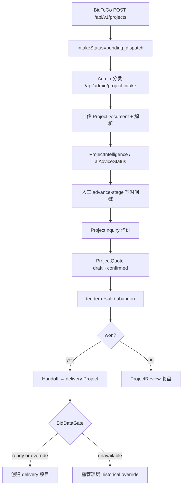

# 青砚投标工作流 — 当前状态审计

| 项 | 值 |
|---|---|
| 基线 | `origin/main` @ `f277518b9743b77cf3f16048fa9be01fff6115ee` |
| 工作区 | `/Users/user/Desktop/青砚-bid-workflow` |
| 分支 | `feature/bid-workflow-optimization`（跟踪 `origin/main`，干净） |
| 日期 | 2026-08-03 |
| 性质 | **只读审计**；不改业务代码 / Schema / migration；不提交 |
| QM Phase 1 | **PAUSED** — Draft PR #52 不并入本分支 |

> 旧报告（`QINGYAN_CORE_FLOW_AUDIT.md`、`QINGYAN_ARCHITECTURE_MAP.md`、`QINGYAN_SYSTEM_INVENTORY.md` 等）仅作线索；下列结论均回落到本 tip 真实文件验证。

---

## 1. Executive Summary

青砚当前**可运行的投标产品闭环**是：

```
BidToGo/外部 API 建项 → 管理员分发 → 上传招标文件并解析
→ AI 情报/Go-No-Go 建议态 → 人工阶段推进（6 步时间戳）
→ 供应商询价 → 项目报价草稿/确认 → 终态（won/lost/no_bid）
→ （可选）复盘/相似项目 → 中标交接交付项目
```

**不可运行的「正式标书数据闭环」**（文档与 DB baseline 有影子，应用层缺失）是：

```
Requirement → Evidence → Compliance Matrix → Tech/Fin Approval
→ Revision Lock → Submission Readiness 硬门禁 → 带页码证据导出
```

关键判断：

| 判断 | 结论 |
|---|---|
| 统一 Tender/Opportunity 事实源？ | **否**。运行时以 `Project(workDomain=tender)` 为准；Bid Data 表在 DB/baseline 存在但正式 Prisma/UI/API **未接入**；`SalesOpportunity` 是销售 CRM 并行体 |
| 端到端完成度（发现→正式提交） | 约 **55–65%**：文档/阶段/询价报价可用；条款级合规、Addendum、锁价审批、提交门禁、可靠中文 PDF **断链** |
| 最危险风险 | Bid Data「幽灵层」、审批多轨、AI 无证据合规结论、UI「需求与合规」假入口、中文 PDF 字体失效 |
| 本轮建议第一步 | **在 Project 主链上做「Requirement+Evidence 最小切片」**，不整包 merge 旧实验树 |

---

## 2. 当前端到端工作流

### 2.1 真实主链（应用层可导航）



阶段机（6 步）：`src/lib/tender/stage.ts`

| 阶段 | key | 证据字段 |
|---|---|---|
| 立项 | `initiation` | 默认 / `tenderStatus=new` |
| 项目分发 | `distribution` | `distributedAt` / `dispatchedAt` / `intakeStatus=dispatched` |
| 项目解读 | `interpretation` | `interpretedAt` |
| 供应商询价 | `supplier_inquiry` | `supplierInquiredAt` |
| 供应商报价 | `supplier_quote` | `supplierQuotedAt` |
| 项目提交 | `submission` | `submittedAt` / 终态 status |

推进入口：`src/lib/tender/stage-transition.ts` + `POST /api/projects/[id]/advance-stage`（强制人工确认）。

### 2.2 文档描述但本 tip 不可导航的链 B

`docs/QINGYAN_CORE_FLOW_AUDIT.md` 描述：上传 → Requirement → Evidence → Compliance → Approval → Lock。  
本 tip：**无** `src/lib/project-bid-data/**`，**无** `projects/[id]/bid-data` 页面/API。  
DB 可能有表：handoff 用 raw SQL 探测（`src/lib/projects/handoff/bid-data.ts`）。  
纪律：`docs/QINGYAN_W1_PR5_AGENT_RUNTIME_BRANCH_DRIFT.md` — Orchestrator/Bid Data 实验树继续隔离，禁止整包进 tip。

---

## 3. 页面 / API / Service / Schema / Agent 对照表

| 能力 | UI | API | Service/Lib | Schema（正式） | Agent/Skill | 状态 |
|---|---|---|---|---|---|---|
| 投标工作区入口 | `(main)/bids/page.tsx` + `bids-workspace-shell.tsx` | `/api/projects` | — | Project | — | **壳可用**；「需求与合规」链到 `/projects` 无专用工作台 |
| 外部建项 | — | `POST /api/v1/projects` | ApiToken + ExternalReference | Project `workDomain=tender` | — | **真** |
| 手动建项 | projects 创建 | `POST /api/projects` | — | 默认 `workDomain=general` | — | **真但非投标** |
| Intake 分发 | `admin/project-intake` | `/api/admin/project-intake/**` | `lib/project-intake` | `intakeStatus` | — | **真** |
| 阶段推进 | `stage-advance-card` / progress section | `/advance-stage` | `lib/tender/*` | 时间戳 + `tenderStatus` | — | **真** |
| 文件上传/解析 | ProjectFileManager | `/files/**` | `lib/files/parse-content` / `ai-summary` | ProjectDocument | document_summary | **真** |
| 情报/Go-No-Go | intelligence-card / ai-summary-card | `/intelligence/**` | formatter/extractor/structured-summary | ProjectIntelligence + `aiAdviceStatus` | tender-bid-no-bid / intelligence_report | **建议态真** |
| 询价 | inquiry 组件 | `/inquiries/**` | — | ProjectInquiry | — | **真** |
| 项目报价 | quote 组件 | `/quotes/**` | `lib/quote/*` | ProjectQuote Decimal | quote skill / bid-package | **真** |
| Checklist | bid-checklist | `/checklist` | — | ProjectDocument `ai_checklist` | tender-disqualification-check | **AI JSON，非硬门禁** |
| 一键投标包 | ai-bid-package | `/ai-bid-package/**` | `skills/bid-package.ts` | AgentTask | 摘要→情报→报价→邮件 | **真编排** |
| 相似/复盘 | review / intelligence 页 | similarities / review / org intelligence | `similarity` / `review` / `org-*` | ProjectSimilarity / Review | project_search_similar | **MVP 真** |
| 生成文档 PDF | — | generate docs API | `lib/projects/generate/*` | ProjectGeneratedDocument | — | **骨架真；中文弱** |
| Handoff | handoff UI | `/handoff/**` | `handoff/execute` + `bid-data` gate | ProjectHandoff | — | **有条件真** |
| Requirement 表 | — | — | enterprise-readonly 近似工具 | **无** | compliance-matrix 技能一次性 JSON | **断链** |
| Evidence/Compliance/Lock | — | — | handoff raw SQL only | baseline 有 / 正式 schema **无** | — | **幽灵层** |
| Addendum 实体 | — | — | 指纹字符串 | **无** | 提交检查文案 | **无** |
| Bid Bond 实体 | — | — | handoff 任务模板 | **无** | skill 输入字段 | **无** |
| Firecrawl 标讯 | — | market-intelligence webhook | trade/market-intelligence | MarketCompetitor 等 | — | **非标讯摄入** |
| Apify | — | — | — | — | — | **不存在** |

---

## 4. 当前真实可用能力

### 4.1 投标机会进入

| 来源 | 现状 | 证据 |
|---|---|---|
| BidToGo / 外部 API | **可用**；强制 tender | `src/app/api/v1/projects/route.ts` |
| 管理员分发 | **可用** | `src/lib/project-intake/service.ts` |
| 人工创建 | **可用但默认 general** | `src/app/api/projects/route.ts` |
| Tender 页面 | 导航壳，**不建项** | `src/app/(main)/bids/page.tsx` |
| PDF/Word/Excel 上传 | **挂已有项目**，可解析 | `ProjectDocument` + `lib/files/*` |
| Firecrawl | 外贸/市场竞品，**非标讯** | `lib/market-intelligence/*`, `lib/trade/research-*` |
| Apify | **无** | 全库无引用 |
| 邮件 | 询价外发，**非标讯摄入** | ProjectEmail |
| OCR | 其它域（标签/画册），**无投标 OCR 管线** | trade/supplier parsers |
| 历史复制/续标 | **未发现** copy Project API | — |

### 4.2 文件与解析

- 上传、parseStatus、aiSummaryJson：**真**（`ProjectDocument`）
- 回填截标/开标/招标号（只填空）：`apply-document-metadata.ts`
- Addendum 版本覆盖、页码级 Evidence：**无模型**
- 缺失文件：AI checklist + proactive `missing_documents` 提示，非结构化缺件表

### 4.3 要求 / 合规

- 技能 `tender-mandatory-compliance-matrix` 可生成一次性 JSON（含 mandatory/rated、sourceReference）
- 工具 `project_get_project_requirements` 自注「只读近似」：`enterprise-readonly.ts`
- **无**逐条确认、责任人、截止日期的持久化 Requirement 行
- **无**「定制可做」vs「已经合规」的强制字段区分（仅 LLM 自由文本）
- **存在** Requirement=0 仍可推进阶段/出报价的路径（阶段与报价不依赖条款表）

### 4.4 产品与供应商

- `Supplier` + `ProjectInquiry`/`InquiryItem`：**真**
- 证书/检测报告/Equivalent/Approved Manufacturer：**无结构化比对引擎**
- 询价可记交期/价格；MOQ/产地在 ProjectQuote 字段级存在

### 4.5 定价

- `ProjectQuote` / `QuoteLineItem`：`Decimal(18,2)`，含 shipping/customs 等 category（`lib/quote/types.ts`）
- 毛利率规则检查：`lib/quote/rules.ts`
- 并行事实源：`SalesQuote`、`TradeQuote`
- **无** Financial Approval → 锁价 → 提交价格绑定的投标专用状态机

### 4.6 技术标 / 商务标生成

- 一键投标包：摘要→情报→报价草稿→邮件草稿（**真**）
- `generate-docs.ts`：RFQ/分析类 PDF 骨架（ helvetica，中文不可靠）
- 带页码引用的合规矩阵导出：**无**
- 防编造：技能安全文案存在；**无**证据绑定强制闸

### 4.7 审批 / 锁定 / 提交

| 名称 | 本 tip 现实 |
|---|---|
| Technical / Financial Approval | 仅 handoff raw SQL 读 `BidDataRevision`；无产品 UI |
| Management Approval | 无独立投标审批实体 |
| Revision Lock | DB 字段可能存在；应用无管理面 |
| Submission Readiness | 技能 checklist，非硬门禁 |
| PendingAction | AI 写动作审批（非标书锁） |
| ApprovalRequest | 旧 AgentTask 步骤审批 |
| ApprovalPort | 收件箱合并两轨（`lib/approval/port.ts`） |

### 4.8 AI / 任务

- Runtime：`agent-core`（统一）；**无**第二 Runtime 进本 tip 产品面
- 投标技能：`tender-seed.ts`（3 条）+ 静态 `lib/agent/skills/*` + `bid-package`
- Grader：运营风险建议 → PendingAction，**非**合规引擎
- 租户：enterprise-readonly 要求 org membership
- 手机端专用投标审批 UI：**未见**独立实现（走通用审批中心）

### 4.9 历史中标 / 周期采购

| 能力 | 现状 |
|---|---|
| 相似项目 | Jaccard/规则 MVP（`similarity.ts`） |
| ourBidPrice / winningBidPrice | Project 字段 + 复盘 |
| 组织胜率/价差 | org-patterns / price-trends |
| 现任/历届中标公司库 | **无** |
| 周期采购预测 | **无** |
| 海关/贸易追查供应商 | Trade intelligence 有 `customs_hint` 类型，**未接入投标主链** |
| Evidence 等级 + 来源 URL | 情报/Trade 侧部分有；投标条款侧无 |

---

## 5. Mock、占位、断链与重复事实源

### 5.1 断链 / 假入口

1. Bids 壳「需求与合规」→ `/projects`（`bids-workspace-shell.tsx`），无合规工作台  
2. 文档/Inventory 登记的 `lib/project-bid-data`、`/bid-data` **本 tip 不存在**  
3. Addendum / Bid Bond / Submission Readiness：**文案与技能有，实体无**  
4. 中文供应商 PDF：模板写「国内」，字体 helvetica（`generate-docs.ts` / `pdf-common.ts`）

### 5.2 重复事实源

| 主题 | 并行体 |
|---|---|
| 机会 | `Project(tender)` vs `SalesOpportunity` vs TradeProspect |
| 进度 | `lib/tender` 阶段 vs `lib/progress` 模块成熟度 vs delivery `deliveryStage` |
| Go/No-Go | `tenderStatus` vs `aiAdviceStatus` vs `Intelligence.recommendation` |
| 报价 | ProjectQuote vs SalesQuote vs TradeQuote |
| 审批 | PendingAction vs ApprovalRequest vs Capabilities vs BidData（幽灵） |
| 需求/证据 | 文档摘要 JSON vs 技能矩阵 vs baseline Bid Data 表 |

### 5.3 DB ↔ Prisma 漂移

- Baseline / greenfield migration：**含** BidDataRevision 等表  
- 正式 `prisma/schema.prisma`：**无**对应 model  
- 应用：仅 `handoff/bid-data.ts` raw SQL；失败 → `BID_DATA_UNAVAILABLE`，需 override  

---

## 6. P0 / P1 / P2 问题清单

### P0（安全/正确性/产品诚实性）

1. **AI 可在无结构化证据时输出合规/去留结论**（技能 JSON，无 Evidence 闸）  
2. **Bid Data 幽灵层**：DB 可能有表、产品无入口；handoff 依赖 raw SQL + override，易误判「已审批」  
3. **审批多轨**：PendingAction / ApprovalRequest / 报告审核 / BidData 锁语义混杂  
4. **UI 假导航**：「需求与合规」无真实工作台，误导负责人  
5. **阶段可在 Requirement=0 时推进到报价/提交建议态**（无硬依赖）

### P1（闭环缺口）

6. Addendum 无版本/覆盖模型  
7. 提交就绪、保证金、保险、签字授权无结构化清单门禁  
8. 技术标/商务标生成缺少页码引用与「内部 vs 客户稿」强隔离  
9. 中文 PDF / 国内任务包不可靠  
10. 手动建项默认 general，易产生「非 tender 伪投标项目」  
11. 历史中标情报未产品化为可验证 Evidence

### P2（增强）

12. 相似项目仍为规则 MVP，非向量/条款级  
13. 周期采购预测、海关追查未进投标主链  
14. Firecrawl 未用于标讯摄入（且合规采集边界需产品定义）  
15. 手机端投标作战看板缺失

---

## 7. 权限、租户、审批与数据安全风险

| 风险 | 说明 | 证据方向 |
|---|---|---|
| 租户隔离 | 项目 API / enterprise 工具要求 orgId + membership；需保持 fail-closed | `enterprise-readonly.ts` `requireOrgMember` |
| Bid Data raw SQL | 绕过 Prisma 类型层；表缺失时行为依赖 override 纪律 | `handoff/bid-data.ts` |
| 审批双轨执行 | ApprovalPort 合并收件，执行仍分流；权限矩阵可能不一致 | `lib/approval/port.ts`, WAVE2 proposal |
| AI 建议写状态 | tender-seed 要求不得直改 `tenderStatus`；依赖人工 PendingAction | `tender-seed.ts` |
| 供应商面脱敏 | `sanitizeSupplierFacing` 存在；需确认导出路径全覆盖 | `generate-docs.ts` |
| 外部采集合规 | Firecrawl 仅既有市场/外贸路径；**不得**设计绕过登录/权限的抓取 | 产品边界 |
| QM Phase 1 | Scope Harness **不在**本分支；勿从 PR #52 带入未完成代码 | 封存纪律 |

---

## 8. 历史中标与周期采购能力现状

**已有（可复用种子）：**

- `ProjectSimilarity` + `similarity.ts`  
- `ProjectReview` + `ourBidPrice` / `winningBidPrice`  
- `projects/intelligence` 组织聚合、价差  
- Trade 域 `customs_hint` 证据类型（未接投标）

**缺失：**

- 采购方历年中标公司时间线  
- 合同期限/延期/amendment 结构化  
- 周期采购预测  
- 「情报 → Evidence（URL/抓取时间/可信度）→ 人工确认 → 才可进决策」管线  

**架构建议（供决策，本轮不实施）：**  
历史中标情报宜作 **Tender 子域（Project 附属 Intelligence/Evidence）**，不宜再造独立 Opportunity 主实体；与 Trade 海关数据通过 **只读引用 + Evidence 等级** 连接，不合并事实源。

---

## 9. AI 数字员工接入点

| 节点 | 现有能力 | 建议角色 | 必须人批？ |
|---|---|---|---|
| 解读/摘要 | document_summary, intelligence | 文件解读员 | 报告审核建议人批 |
| Go/No-Go | tender-bid-no-bid | 去留顾问 | **是**（改建议态/任务） |
| 合规矩阵 | tender-mandatory-compliance-matrix | 合规编制员 | **是**（逐条确认后才算数） |
| 废标/提交检查 | tender-disqualification-check | 提交检查员 | **是**（硬门禁应由系统+人） |
| 询价/报价草稿 | bid-package, quote | 采购/定价助理 | 报价确认/外发 **是** |
| 国内任务包 | generate-docs（弱） | 协同秘书 | 发送 **是** |
| 写外部消息/改价/锁标 | — | — | **始终人批；禁止自动** |

原则：**AI 建议与真实执行分离**；合规结论无 Evidence 不得落「已满足」。

---

## 10. 国内供应商协同与中文 PDF 方案（建议挂载点）

**挂载节点（推荐）：** `supplier_inquiry` 阶段之后、报价确认之前。

最小能力：

1. 从已确认 Requirement/缺口生成「中文询价任务包」  
2. 使用 **中文字体** PDF（替换 helvetica）  
3. 脱敏内部预算/毛利（复用 sanitize）  
4. 任务落到现有 Task / ProjectInquiry，不新建协同平台  
5. 回传报价写入 InquiryItem → 驱动 ProjectQuote  

**不应**在 Bid Data 幽灵层上挂协同。

---

## 11. 推荐的目标工作流

```
发现(BidToGo/人工标为 tender)
  → 分发与负责人
  → 文件+Addendum 版本库
  → Requirement 提取（AI 草稿）→ 人工逐条确认
  → Evidence 绑定（证书/参数/承诺，含页码）
  → Compliance（met/partial/missing；定制可做 ≠ 已合规）
  → 询价（国内中文包）→ 成本回传
  → 报价版本 + 毛利规则 + Financial 确认
  → 技术标/商务标生成（仅引用已确认 Evidence）
  → Tech/Fin/Mgmt 审批（收敛到单一审批端口）
  → Revision Lock + Submission checklist 硬门禁
  → 提交记录（时区/文件清单/acknowledgement）
  → 结果复盘 → 相似/中标情报沉淀为 Evidence
```

约束：单一运行时事实源 = **`Project(workDomain=tender)`**；Bid Data 能力以 **additive 收敛进主链** 或明确废弃，禁止长期双写。

---

## 12. 分阶段改造建议

| 阶段 | 目标 | 不做 |
|---|---|---|
| **S0 诚实化** | 修假导航；文档标明 Bid Data 未接入；手动建项可选 tender | 不 merge 实验树 |
| **S1 最小合规切片** | Requirement + Evidence 最小表/或 JSON 版本化 + UI 逐条确认 | 不做完整 Lock 树 |
| **S2 询价中文包** | 中文字体 PDF + 任务包 | 不建新协同产品 |
| **S3 报价锁定** | 确认价 ↔ 提交价绑定；毛利闸 | 不扩 SalesQuote |
| **S4 审批收敛** | Tech/Fin/提交 checklist 进 ApprovalPort 单一体验 | 不保留第三审批表 |
| **S5 中标情报** | 采购方历史 + Evidence 等级 | 不合规爬取 |

---

## 13. 建议首先实施的一个最小切片

**名称：投标 Requirement 确认板（Project 附属）**

范围：

1. 从已解析 `ProjectDocument` / Intelligence 生成 Requirement 草稿（可先版本化 JSON，或极薄 additive 表）  
2. UI：逐条确认 / 驳回 / 责任人 / 风险 /「已合规 vs 定制可做」  
3. 未确认强制项数量 > 0 时，**阻止**「提交准备完成」类状态（阶段推进可警告）  
4. 合规矩阵技能改为 **读写已确认 Requirement**，禁止无来源写 met  
5. Bids 壳「需求与合规」链到真实页  

验收：任意测试项目可演示「0 确认要求 → 不能宣称合规；确认后矩阵可追踪」。

**明确排除：** Revision Lock 全树、Apify、自动外采、QM Harness、整包旧 Bid Data UI。

---

## 14. 需要产品决策的问题

1. **Bid Data 表**：废弃并停止 handoff 依赖，还是正式纳入 Prisma 并做产品 UI？  
2. **手动创建项目**：是否强制选择 workDomain=tender，或投标入口单独建项？  
3. **Go/No-Go**：`aiAdviceStatus` 与 `tenderStatus` 谁是对外唯一状态？是否要 Management 审批实体？  
4. **报价真相**：投标是否只认 `ProjectQuote`，Sales/Trade 报价如何引用？  
5. **审批收敛**：Tech/Fin/提交是否全部走 PendingAction/ApprovalPort，还是恢复 BidDataRevision？  
6. **历史中标情报**：Tender 子域 vs 独立模块？数据来源合规边界？  
7. **国内协同**：仅 PDF+任务，还是要供应商门户？  
8. **Addendum**：是否 P0（影响条款覆盖）？  
9. **最小切片**：是否批准 §13 Requirement 确认板作为第一阶段？

---

## 15. 架构十问（直接回答）

1. **唯一事实源？** 运行时投标机会 = `Project(workDomain=tender)`；文件 = `ProjectDocument`；报价 = `ProjectQuote`；情报建议 = `ProjectIntelligence`/`aiAdviceStatus`；正式结果 = `tenderStatus`。Bid Data 不是应用层事实源。  
2. **可用 vs mock？** 见 §3/§4；合规工作台与 Lock 为文档/DB 影子；Bids「需求与合规」为假入口。  
3. **闭环走到哪？** 到「询价+项目报价确认+终态/交接（常需 Bid Data override）」；到不了「条款证据锁定后正式提交门禁」。  
4. **最危险五断点？** 见下节聊天汇报。  
5. **重复模型？** 是 — Project/SalesOpportunity、三套 Quote、多套审批、进度双轨、需求三层。  
6. **保留/收敛/停扩？** 保留 Project+tender 阶段+Inquiry+ProjectQuote+Intelligence；收敛审批与报价；停扩孤立 Bid Data UI / 第二 Runtime / 不合规采集。  
7. **历史中标？** Tender 子域（Evidence 化），非新主实体。  
8. **国内 PDF？** 挂 `supplier_inquiry` 节点。  
9. **数字员工？** 解读/矩阵草稿/检查/任务包；改状态、外发、锁价、宣称合规必须人批。  
10. **最小闭环？** §13 Requirement 确认板。

---

## 16. 证据索引（真实路径）

| 主题 | 路径 |
|---|---|
| Project / tender 字段 | `prisma/schema.prisma`（Project ~L232+） |
| 阶段机 | `src/lib/tender/stage.ts`, `stage-transition.ts` |
| BidToGo 建项 | `src/app/api/v1/projects/route.ts` |
| 手动建项 general | `src/app/api/projects/route.ts` |
| Intake | `src/lib/project-intake/`, `src/app/(main)/admin/project-intake/` |
| Bids 壳假链接 | `src/components/bids/bids-workspace-shell.tsx` |
| 文件解析 | `src/lib/files/parse-content.ts`, `ai-summary.ts` |
| Bid Data gate | `src/lib/projects/handoff/bid-data.ts` |
| Baseline Bid Data 模型 | `prisma/baseline/schema.pre-phase4.prisma` ~L5314+ |
| 正式 schema 无 Bid Data | `prisma/schema.prisma`（无 BidDataRevision model） |
| 隔离纪律 | `docs/QINGYAN_W1_PR5_AGENT_RUNTIME_BRANCH_DRIFT.md` |
| 投标技能 | `src/lib/agent-core/skills/tender-seed.ts` |
| 需求近似工具 | `src/lib/agent-core/tools/enterprise-readonly.ts` |
| 投标包 | `src/lib/agent-core/skills/bid-package.ts` |
| 报价 | `src/lib/quote/`, ProjectQuote schema |
| 相似/复盘 | `src/lib/projects/similarity.ts`, `review.ts` |
| PDF | `src/lib/projects/generate/generate-docs.ts`, `pdf-common.ts` |
| 审批双轨提案 | `docs/QINGYAN_WAVE2_APPROVAL_CONSOLIDATION_PROPOSAL.md` |
| 旧链 B 描述 | `docs/QINGYAN_CORE_FLOW_AUDIT.md`, `QINGYAN_ARCHITECTURE_MAP.md` |

---

## 17. QM Phase 1 封存备忘

| 项 | 状态 |
|---|---|
| Draft PR #52 | 保持 Draft；不再加功能 |
| 状态标签 | `PAUSED / REQUEST_CHANGES / NOT_READY_FOR_MERGE` |
| 剩余待办（本轮不处理） | 删除 pendingActionProposal 信任；claim 租约栅栏；隔离库 migration；正式审查 |
| 本分支 | **未**包含 QM Phase 1 未完成代码 |

---

**审计完成。暂停，等待确认目标方案与第一阶段实施范围后再动手写代码。**
